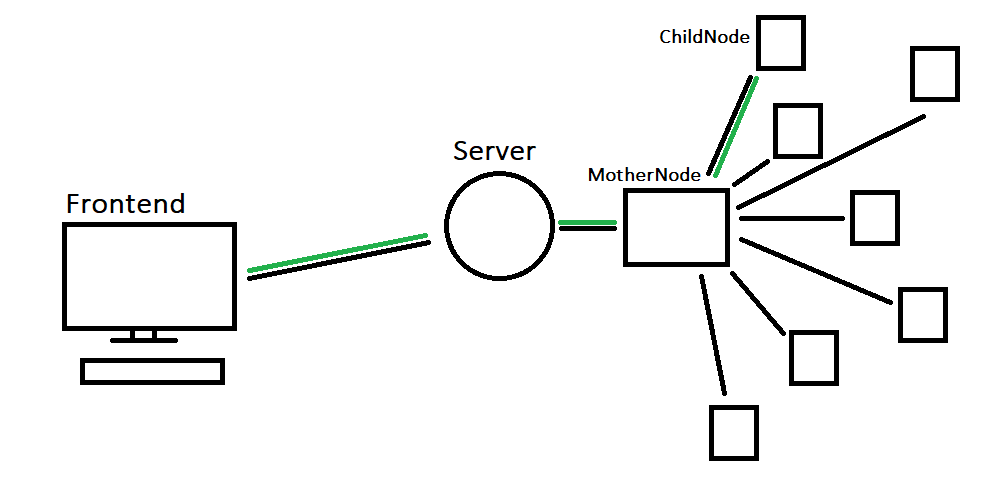

# 183_backend

GOTO [Frontend](https://github.com/BusinessTable/183_frontend/blob/main/README.md) to see Frontend implementation

## Grundkonzept

Unser Backend besteht aus express und funktioniert, indem eine MotherNode bei Start erstellt wird.

Diese MotherNode handled verschiedene ChildNodes welche je einen User darstellen.

Diese User speichern und handeln die Passwörter.

Wir haben ein React Frontend, in welchem man die möglichkeit hatsich zu Registrieren / ein zu Loggen und seine Passwörter zu verwalten.

Wenn man sich registriert wird auf dem Backend eine neue ChildNode erstellt die einen User darstellt.

In dieser werden alle Passwörter des einzelnen Users gespeichert.

Wenn ein User via FRontend sich einloggt erhält er ein JWT Token, das bei jedem weitern API Call abgefragt wird.

Wenn es nicht mehr gültig oder nicht zu dem User gehört, wird der Request blockiert.

Wenn der Request durchkommt, wird zum Beispiel eine Liste von Passwörtnern zurückgegeben,
diese werden dann wieder im Frontend decrypted und für den User bereitgestellt.

## How to use

Man Klont dieses und das Fronted repositiory auf seinen Computer und führt

1. `npm clean install`
2. `npm run start`

Um das Backend zu testen, kann man auch bei gegebenen Zugriff, die Postamn Collection nutzen.

Als erstes muss man sich via dem /Register Endpoint einen Bearer Token holen.

Danach kann man diesen in der Collection unter Variables als token mitgeben. Siehe Grafik:

Danach kann man die bereit gestellten Endpoints benutzen.

## Reflexion 30.05.2024

Wir konnten grosse Fortschritte machen heute mit dem Backend, wir haben uns auch bereits entschieden wie wir in der Zukunft weiter machen werden, und was noch fehlt.

Jedoch haben wir gerade eine Änderung im backend, wegen der die Endpoints nicht mehr funktionieren. Das ist aber korrekt, da das Problem eigentlich ist, dass das Passwort hashing noch nicht fertig funktioniert.

Was heisst, dass der User sich lediglich nicht Authorisieren / Authentisieren kann.

Wir sind überzeugt, dass unser Projekt ein Gutes Resultat erreichen wird.

Leider konnten wir daher im Frontend nicht viel weiteres machen, da nur noch die Endpoints fehelen.

## Reflexion 06.06.2024

Wir machten gute Fortschritte mit unserem Projekt, vor allem was das zusammenspiel vom Frontend und Backend laufen.

Wir sind sehr zuversichtlich, dass wir mit unserem Projekt fertig werden.

Dazu glauben wir, dass wir es schaffen werden, dass Projekt direkt im Web zu hosten.

Gegen Ende haben wir aber unsere Zeit mehr darauf konzentriert zu Planen was noch fehlt und was wie wir diese Dinge lösen können.

# Functional Programming

Hier zeigen wir die besten functions die wir in Anlehnung auf die Funktionale Programmierung erstellt haben.

## Pure Functions

Pure functions sind Funktionen, die einen Output ausgeben ohne Nebeneffekte ausführen zu können.

     async function noWayBack(pwd, salt) {
         salt = salt ? salt : await bcrypt.genSalt(saltRounds);

         return { salt: salt, hash: await bcrypt.hash(pwd, salt) };
     }

---

     function generateAccessToken(payload) {
         return {
             token: jwt.sign(payload, process.env.TOKEN_SECRET, {expiresIn: "900s"}),
         };
     }

---

## Higher-Order Functions

Higher-Order functions sind Funktionen, die andere Funktionen aufnehmen.

Bei uns dargestellt durch die unless MEthode, die eine middleware anwendet ausser für die Params die mitgegeben werden

     const unless = function (middleware, ...paths) {
         return function (req, res, next) {
             const pathCheck = paths.some((path) => path === req.path);
             pathCheck ? next() : middleware(req, res, next);
         };
     };

## Immutability

Wir haben die wichtigsten Werte mit Object.freeze() geschützt, dass man diese nach der generierung nicht mehr verändern kann.

    ChildNode.js

     constructor(username, masterpassword, salt) {
         // other initializations...
         Object.freeze(this.username);
         Object.freeze(this.masterpassword);
         Object.freeze(this.salt);
     }

## Higher-Order Array Functions

Hier nutzen wir die Higher-Order Array Functions map / filter

     deleteRubrik(uuid) {
         this.rubriken = this.rubriken.filter((rubrik) => rubrik.getUUID() !== uuid);
     }

     removePassword(uuid) {
         this.passwords = this.passwords.filter(
             (password) => password.getUUID() !== uuid
         );
     }

     updatePassword(uuid, newPassword) {
         return this.passwords = this.passwords.map((password) => {
             if (password.getUUID() === uuid) {
                 return newPassword;
             }
             return password;
         });
     }

---

Für unser Paging der Passwörter, nutzen wir slice:

    getPasswordsPaged(page) {
        return this.passwords.slice(page * 10 - 10, (page + 1) * 10 - 10);
    }

GOTO [Frontend](https://github.com/BusinessTable/183_frontend/blob/main/README.md) to see Frontend implementation
